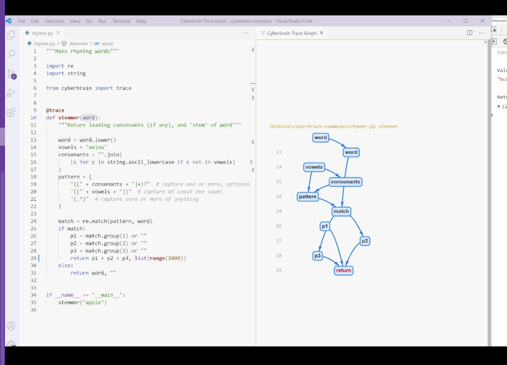
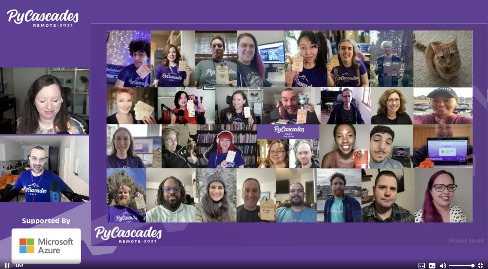
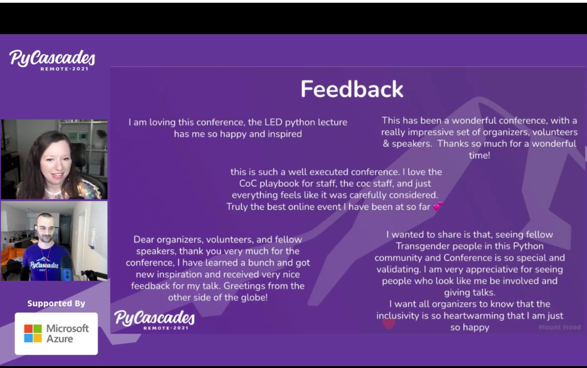
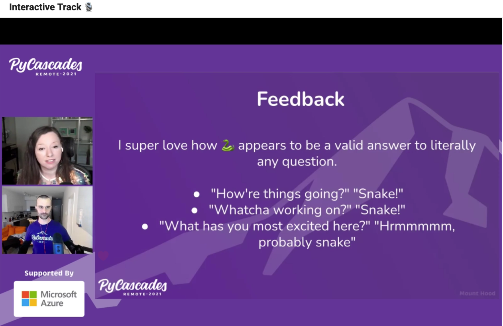

# Pycascades 2021

Notes from the virtual conference

Schedule: <https://2021.pycascades.com/program/schedule/>

MS Cloud skills challenge: <https://www.microsoft.com/en-us/learncloudchallenge/363bd7e2-e465-4262-b272-2079cb5840ca>

- [Pycascades 2021](#pycascades-2021)
  - [Core Python Devs On How Covid Has Changed Core Python Development](#core-python-devs-on-how-covid-has-changed-core-python-development)
    - [Has Being At Home Been Less Productive For You For OSS?](#has-being-at-home-been-less-productive-for-you-for-oss)
    - [Now With Covid, How Have You All Recreated Collaboration Virtually?](#now-with-covid-how-have-you-all-recreated-collaboration-virtually)
    - [Do You Feel Like Communication Has Been Harder Or Easier With Folks?](#do-you-feel-like-communication-has-been-harder-or-easier-with-folks)
    - [How Has The Diversity Mentoring Initiative Been Going And Has COVID Made That More Challenging?](#how-has-the-diversity-mentoring-initiative-been-going-and-has-covid-made-that-more-challenging)
    - [Any New Python Features You Re Excited About?](#any-new-python-features-you-re-excited-about)
    - [Audience Question: Guido - Any Plans To Integrate Python Further Into Excel?](#audience-question-guido---any-plans-to-integrate-python-further-into-excel)
    - [Audience Question: How Does The Mentoring Work And When Do You Think A Person Is Ready To Be Mentored?](#audience-question-how-does-the-mentoring-work-and-when-do-you-think-a-person-is-ready-to-be-mentored)
    - [What Are You Doing To Stay Connected With Community Remotely?](#what-are-you-doing-to-stay-connected-with-community-remotely)
    - [Wrap-Up: Anything You Would Like To Share?](#wrap-up-anything-you-would-like-to-share)
  - [Everything You Need To Know About Writing Technical Python Books](#everything-you-need-to-know-about-writing-technical-python-books)
    - [How Did That Moment Happen When You Started Writing A Book?](#how-did-that-moment-happen-when-you-started-writing-a-book)
    - [What Is The Biggest Challenge In Writing Technical Books?](#what-is-the-biggest-challenge-in-writing-technical-books)
    - [Is It Outline/Scope First?](#is-it-outlinescope-first)
    - [Self Publish Vs Publisher?](#self-publish-vs-publisher)
    - [Struggles From Idea To Finish, Any Other Challenges?](#struggles-from-idea-to-finish-any-other-challenges)
    - [What Are The Funnest Parts?](#what-are-the-funnest-parts)
    - [What Do You Use To Put The Book Together?](#what-do-you-use-to-put-the-book-together)
    - [What Can You Do To Keep A Unique Voice?](#what-can-you-do-to-keep-a-unique-voice)
    - [What Is Your Favourite Tech Book You Have Tried To Model?](#what-is-your-favourite-tech-book-you-have-tried-to-model)
    - [Last Thoughts?](#last-thoughts)
  - [Fireside Chat With Lukasz Langa & Dustin Ingram About Tooling For Python Development](#fireside-chat-with-lukasz-langa--dustin-ingram-about-tooling-for-python-development)
  - [Sparking Creativity in LED Art With CircuitPython](#sparking-creativity-in-led-art-with-circuitpython)
  - [Let's Rethink Debugging](#lets-rethink-debugging)
    - [Four Types of Errors](#four-types-of-errors)
    - [History of Debugging](#history-of-debugging)
    - [Debugging Methods](#debugging-methods)
      - [Print](#print)
      - [Logging](#logging)
      - [Debugger](#debugger)
    - [Rethink Debugging: Two Pain Points](#rethink-debugging-two-pain-points)
    - [Novel Approach](#novel-approach)
    - [DAP (Debug Adapter Protocol)](#dap-debug-adapter-protocol)
  - [Making Games With PPB](#making-games-with-ppb)
  - [Introducing the FARM Stack: FastAPI, React, and MongoDB](#introducing-the-farm-stack-fastapi-react-and-mongodb)
  - [Unit Testing Jupyter Notebooks - testbook](#unit-testing-jupyter-notebooks---testbook)
  - [All About Podcasting: By the Hosts Of Talk Python to Me, Test & Code](#all-about-podcasting-by-the-hosts-of-talk-python-to-me-test--code)
    - [How did you get your starts in podcasting?](#how-did-you-get-your-starts-in-podcasting)
    - [BRian when was T&C inception?](#brian-when-was-tc-inception)
    - [When you started out how do you find guests?](#when-you-started-out-how-do-you-find-guests)
    - [Which episodes stand out to you?](#which-episodes-stand-out-to-you)
    - [How would you suggest go about finding Sponsors?](#how-would-you-suggest-go-about-finding-sponsors)
    - [How has the last year & COVID changed podcasting for you?](#how-has-the-last-year--covid-changed-podcasting-for-you)
    - [How is livestreaming going?](#how-is-livestreaming-going)
    - [What is the bare minimum essentials for gear?](#what-is-the-bare-minimum-essentials-for-gear)
    - [On the Software Side, What sort of Software tools would you recommend?](#on-the-software-side-what-sort-of-software-tools-would-you-recommend)
    - [How long is the time committment for you?](#how-long-is-the-time-committment-for-you)
    - [How do you get connected to publishing platforms?](#how-do-you-get-connected-to-publishing-platforms)
    - [Have you noticed any changes in listerers or habits since COVID?](#have-you-noticed-any-changes-in-listerers-or-habits-since-covid)
    - [How much do you prep your guests?](#how-much-do-you-prep-your-guests)
    - [What is your weird podcasting tip?](#what-is-your-weird-podcasting-tip)
    - [How Do you Do Podcast Analytics when there are so many platforms?](#how-do-you-do-podcast-analytics-when-there-are-so-many-platforms)
    - [What Podcast App DO you reocmmend for listening?](#what-podcast-app-do-you-reocmmend-for-listening)
  - [Closing Remarks](#closing-remarks)
  - [Misc Links](#misc-links)

## Core Python Devs On How Covid Has Changed Core Python Development

Nina Zakharenko hosted, panelists: Guido Van Rossum, Carol Willing, Brett Cannon, Mariatta Wijaya

### Has Being At Home Been Less Productive For You For OSS?

- Brett: depends on time of year
- Mariatta: same for her, already working from home. 2 kids who didn't go to
  school for awhile, hard to juggle competing priorities.
- Carol: definitely less productive. Emotional toll.
- Guido: was tehcnically not working when COVID hit.  Kept active for awhile,
  then parks were shut down, etc, then things changed.  Pattern matching PEP
  review process was frustrating/drawn out.  Ultimately left retirement & went
  to MS.

### Now With Covid, How Have You All Recreated Collaboration Virtually?

- Mariatta: Python Language Summit, had to cancel in-person, last minute decided
  to do virtual.  Planned in very short time.  Virtual sprint in Oct, # of PRs
  was not comparable to prior years.
- Guido: agreed, as virtual events go Oct sprint was the best he attended, but
  still full of distractions (family in background, etc).  Different people
  dominate conversations, etc.  Lots of positive things, but at end of the day
  is very different (in person rejuvenates you, etc, no immersion).
- Carol: productive in a different way, convos were focussed differently
- Brett: less organic conversations, no 24/7 imemersion, no accidental
  overhearing of convos that you join in

### Do You Feel Like Communication Has Been Harder Or Easier With Folks?

- Brett: internal communication has been the same.  Were already geo dispersed,
  etc. Tech discussions rarely get put off.  Not aware of any examples of being
  put off
- Guido: particular person was unavailable, had he been available at conference
  process would have been speedier.  On the plus side until March never occurred
  to use Zoom for certain types of connections with other core devs. For certain
  things, can be very useful.  For some people interaction style is very
  different over Zoom than say email, etc.
- Carol: (missed what she said here)
- Nina: empathy is important, don't know what people are going through right now
  (kids, depression, etc)

### How Has The Diversity Mentoring Initiative Been Going And Has COVID Made That More Challenging?

- Guido: currently mentoring 1.5 people (woman & person from SE Asia). In both
  cases going better than before. Being able to hop on Zoom occasionally has
  been helpful.
- Mariatta: had session about this in mentored sprints, had some action items,
  some have been slow going. Its something that many do think a lot about, but
  time has been a challenge.
- Carol: travelling to conferences was how I got people interested in core
  Python, now that's harder.  Finding opportunities to encourage/be positive to
  new core devs.

### Any New Python Features You Re Excited About?

- Brett, Carol & Guido: pattern matching!
- Brett: working on standard for lock file.
- Carol: moving issues to Github(?) (much credit from other panelists to Mar)

### Audience Question: Guido - Any Plans To Integrate Python Further Into Excel?

(everybody laughed)

- Guido: the formula language will never be rplaced with Python.  That's been
  looked at, but not feasible (too confusing).  Where he sees openings: maybe
  extensions that run in the cloud particularly on mobile.  The ideas are with
  the Excel team

### Audience Question: How Does The Mentoring Work And When Do You Think A Person Is Ready To Be Mentored?

- Carol: it starts whenever you take the initiative you wish to contirbute to
  core python.  Separate contributing to core is different than being a core
  dev.  Having basic skills like using Git & Github should be fostered first.
- Mariatta: in general (in any OS project), its rare that you would have a
  dedicated mentor mentoring you.  I was very lucky to have Guido.  You as the
  mentee are the one in charge, to seek help, start your journey without
  waiting, ask questions, etc.  Its your own journey, we don't know what you
  need to know, or where you would be able to help.

### What Are You Doing To Stay Connected With Community Remotely?

- Brett: I'm on the sterring council so I have a weekly touchpoint to hang out.
  Check discourse & Twitter, try to participate.  But it is a little tough as
  it's not the same as a full-day Pycon hangout.  Does take more effort.
- Carol: trying to answer questions on Pyladies.  Much of scientific community
  was already distributed.  Mentoring some other people who are learning Python.
  Trying to bring in people when teaching.
- Guido: same boat as Brett, miss in person connections, but hitting up online
  spots: Bug tracker, pull requests, mailing lists, etc.
- Mariatta: similar thing, mailing list, discord, pyladies slack.  Continue
  speaking at conferences virtually (hated at first).
- Carol: I miss the travel!
- Mariatta: I do too but nice to not have to be separated from family
- Brett: I miss the people, not the airplanes

### Wrap-Up: Anything You Would Like To Share?

- Brett: thank you for being here, thanks to Nina!  Community at this conference
  is awesome
- Carol: Ptyhon has always been such a key part of research going on to resolve
  things in scientific community, has remained positive which is amazing.  So
  many people care so much about moving things forward is inspiring.
- Mariatta: echo all that.  "Here for the language, staying for the community".
  I get asked a lot about how Python is better than other communities, but I
  don't know, but I stay because of you all.

---

## Everything You Need To Know About Writing Technical Python Books

- Al Sweigart - Automate the Boring Stuff
- April Speight - Bite Size Python & soon to be Visual Studio Code for Python
- Harry Percival - Test Driven Development with Python & Architecture Patterns with Python

Author links:

- <https://www.amazon.com/Bite-Size-Python-Introduction-Programming/dp/1119643813/ref=sr_1_1?crid=2WDSGAPPGANWN&dchild=1&keywords=april+speight&qid=1613845789&sprefix=april+speight%2Caps%2C187&sr=8-1>
- <https://www.goodreads.com/author/show/7033347.Harry_Percival>
- <https://www.goodreads.com/author/show/4079189.Al_Sweigart?from_search=true&from_srp=true>

### How Did That Moment Happen When You Started Writing A Book?

- April: had no intention of writing book.  Planend to do YT videos.  Someone
  saw that & asked if she had interest in writing a book.  Moved YT outline to
  book outline, and went from there.
- Harry: Somebody emailed me "hey I'm trying to write this book & you might want
  to write a chapter", laughed off, but said would like to write a book similar
  to my blog stuff, and they were welcoming.  Didn't go with them because they
  were big publisher & wouldn't do CC.  Then looked for different pub and found
  Oreilly
- Al: 11 years ago gf was a nanny for boy who wanted to learn to code, but hard
  to find cohesive tutorial for absolute beginners.  Started tutorial that
  ballooened into a book online.  Trying to capture magic from old books from
  when he was a kid (C64 example).  2 others, then went to No Starch to do
  Automate the Boring Stuff.

### What Is The Biggest Challenge In Writing Technical Books?

(Emphasis On Technical)

- April: first book assumed no knowledge.  Being able to intro concepts in a way
  to add in technical concepts becomes challenging.  YT vids & blog posts were a
  different audience (not children), so that was challenging.  Had kids read
  book as writing to get feedback.  2nd book, night & day, issues running into
  scope & what reader does & doesn't know.  It's a learning process.
- Al: style is to see book is a self contained reference.

### Is It Outline/Scope First?

- Harry: approached 1st book as agile project, here's all the things I want to
  write about, & prioritize.  Publisher feedback/pushback was helpful to limit
  scope.  Having people read drafts as you go, just like TDD early feedback
  allows you to correct course early.
- Al: my books tend to grow in size.

### Self Publish Vs Publisher?

- Al: 1st 3 books were self published.  Enjoyed having publisher & team of prof
  editors.  The book is a collaborative team effort.
- April: humbling thing is editor feedback. Trust the technical editor I chose
  which helps. Remember feedback isn't to tear you down, but it's there to see
  you be successful.
- Harry: you guys are bigger than I am.  I immediately go into lawyer mode when
  I get feedback ("what do you mean !?!?!")

### Struggles From Idea To Finish, Any Other Challenges?

- Al: motiviation is a matter of sticking your head down & doing, some days are
  better than others.  Main problem: coming up with actual topics for books.
  Hard becasue there are so many good resources out now.
- Harry: helps if you feel there's a need for this book
- April: how do you stay motived?  I have a contractual agreement!  I like the
  writing piece, but the contract is enough.

### What Are The Funnest Parts?

- Harry: the legions of adoring fans! (jokingly)  You do make a connection with
  people.  Seeing people understand a concept, thanks from readers, etc.
  Definitely not in it for the money.
- Al: same.  Reading the 1-star reviews on Amazon.  Some are completely off
  base, occasionally will point out something legitamate
- April: 2 most fun things: all the illustrations (I did myself could be
  creative), coming up with non-generic names to make book more fun (also more
  culturally sensitive).

### What Do You Use To Put The Book Together?

- Al: 1st book used text files & html by hand.  Don't do this.  Now with NSP,
  they have a Word template & use that.
- April: we use Word, there's an extension you have to use.  Code is copy/pasted
  from VS Code to there.  Screenshots help.
- Harry: Oreilly is very different, insteda they have a text markup format
  (asciidoc).  Similar to markdown.  Have a platform that uses git (so VC on
  it).

### What Can You Do To Keep A Unique Voice?

- Harry: I'm a clown, you can tell. Wnated to have humour in the books.
  Important to have personality in your books.  You feel a genuine human
  connection to authors.  You engage with them on an emotional level.  Kent Beck
  example. Convey that joy of programming because (esp in beginners) early is
  not joyful.
- Al: sneak in little puns & jokes.  At same time feel other pull don't want to
  make so many cultural references (ex: Japanese audience might not pick up on
  those references).  Need to be plain direct, etc, but balance with humour.
- April: first book & 2nd book were so different.  Cover allowed to show
  personality.

### What Is Your Favourite Tech Book You Have Tried To Model?

- April: fashion books.  Model after people on YT.
- Al: favourite book, found as an adult: Basic Computer Games (find at
  <https://www.atariarchives.org/basicgames/>)  Book just listed source to 100
  different games in BASIC.  Few games that remember as a kid that were copied
  from that book.
- Harry: TDD By Example (Kent Beck).  Wise Poinant Guide to Ruby.

### Last Thoughts?

- April: if you think you want to write a book, be realistic about how much bandwidth you have in your life.

Their books:

- <https://www.obeythetestinggoat.com>
- <https://www.cosmicpython.com>
- <https://www.inventwithpython.com>
- <https://www.buildandcode.com>

---

## Fireside Chat With Lukasz Langa & Dustin Ingram About Tooling For Python Development

Weird lengthy discussion about some CVE in Python?

- Luk: What's your favourite tool for packaging? Dustin: pretty "barebones".
  piptools has pip-compile & is useful.  Looks a little bit like a lockfile.
  Black is cool too, what started the process for developing it.
- Luk: in 2015 I had contributed to yapf, plan was to rollout to Facebook, but
  not an easy task (20m+ lines of code).  ....long historical discussion ....

Sloppy programming - write whatever you want, have editor save file & auto-format with Black.

Static analysis tools - Bandit, mypy

flake8 & pylint

Kate McLaughlin's notes of talk: <https://glasnt.com/blog/pycascades-packaging>

---

## Sparking Creativity in LED Art With CircuitPython

Debra Ansell

<github.com/geekmomprojects/PyCascades2021>

Very cool walkthrough/demo of working with CircuitPython & LEDs.

---

## Let's Rethink Debugging

laike9m, <https://github.com/laike9m>

### Four Types of Errors

1. Fail to compile
2. exit abnormally
3. program can run but gives wrong results
4. result is correct but program consumes too much resources

Focus on #3.

### History of Debugging

EDSAC

Debuggers in 80's (gdb released in 1986)

### Debugging Methods

- print()
- logging
- debugger

#### Print

Print is avaiable out of box, no redundant info, normally won't change behaviour, can answer "has this line been run?"

But, you need to know where to put the print, requires code modification, lacks context, hard to manage output

#### Logging

More configuerable, easy to mange output, richer context (line #'s etc)

More combursome to configure, not always available out of the box

#### Debugger

Powerful, with more features, doesn't require familiarity with code, hlep to find root cause more easily

But depends on certain lib/editor/ide, some learning curve, no way to persist info, performance issue

### Rethink Debugging: Two Pain Points

No tool as easy as print, yet powerful as a debugger

Existing tools only give clues, but don't tell you why something is wrong

### Novel Approach

Who has the information we need for debugging?  The Python Interpreter

Dive into bytecode & Python VM.

Use of settrace to have a callback to get useful debugging info.

Led to Cyberbrain <https://github.com/laike9m/Cyberbrain>

Gives visual graph of execution with values, so helps to identify where calculations went wrong.

Existing tools are becoming calcified.

### DAP (Debug Adapter Protocol)

Specification to define capabilities of a debugger.

- Other tools Pysnooper, iceCream, Hunter, pytrace - trace function calls, automate process of adding print()
- birdseye, Thonny - graphical debuggers that can visualize values of expressions
- Python tutor - web based interactive program visualization

---

## Making Games With PPB

Piper Thunstrom

Technical difficulties, screen went green

PPB PursuedPyBear <https://ppb.dev/>.  Showed demo of how to build up a simple game with library.

Had to leave talk early to go to the MEAN talk.

---

## Introducing the FARM Stack: FastAPI, React, and MongoDB

Aaron Bassett

- <https://github.com/aaronbassett/FARM-starter>
- <https://git.io/JtShS>

FastAPI, Mongodb with Motor, React

Walked through creation of a TODO app using this stack.

---

## Unit Testing Jupyter Notebooks - testbook

Rohit Sanjay & Matthew Seal

Testbook: <https://github.com/nteract/testbook>

Testbook is a unit testing framework for testing code in notebooks. Pytest style tests for notebooks in separate .py files.

---

## All About Podcasting: By the Hosts Of Talk Python to Me, Test & Code

Brian Okken & Mike Kennedy

### How did you get your starts in podcasting?

- Brian: had a fear of public speaking, and podcasting was a way to tackle it.
- Mike: been a fan of podcasts for a long time, switched to Python from other
  stuff he was doing, and wanted to get into the ecosystem.  Where are the
  podcasts?  At the time there were none.  So started and it took off rom there

### BRian when was T&C inception?

- Brian: was before Python Bytes with Mike.  Was writing about testing in Python
  for a few years, had a short book, etc.  Really wanted to interact with
  people, but blog posts didn't have that give & take.  Early scripted podcast
  episodes, was super nervous.  About 6 months in, Mike approached with the idea
  of Python Bytes.  Helped to have two people, keeps you accountable.

### When you started out how do you find guests?

- Mike: had first 5 episodes figured out (5 friends).  Just have to be curious &
  ask good questions.  In the beginning was hard.
- Brian: in beginning was blown away, didn't know anyobody in python ocmmunity.
  Early in T&C interviewed people with testing voices (not necessarily Python),
  found them by just emailing and just asking.

### Which episodes stand out to you?

- Mike: Like picking favourite child.  Had convos with people who would never
  come up on radar on Talk Python and were blown away by what those people had
  accomplished.  Ex: the F1 wind tunnel optimization
- Brian: kind of a mix.  David Hussman episode was one where worked hard to get
  him on, instrumental in chaos engineering.  Was on in 2017 & passed away in
  2018 so honorable.  Random surprises: AB testing at Comcast example.  Can be
  hard to come up with questions ahead of time for people who are in domains
  that am unfamiliar with.

### How would you suggest go about finding Sponsors?

- Brian: I reached out to a few people, but have had a few sponsors reach out
  recently, but early on was all self-initiated.  Really tough at the beginning.
- Mike: after 3 months had some ads, from people who reached out.  Now I reach
  out, about 1/3rd are from me reaching out, 2/3rds from people contacting me.
  In early days, think about what websites that have ads for products that my
  listeners go to, and target them.

### How has the last year & COVID changed podcasting for you?

- Brian: incredibly easier.  Before pandemic I was working 3 miles from home,
  just do it at lunch.  Then company moved & was hour away, so had to negotiate
  when to do at the office.  But now since at home is totally easier because
  always working from home.
- Mike: have been working from home for some time, and also self-employed.
- Brian: guests are better because everybody has audio equipment at home now.
- Mike: more scheduling coordination because of kids being around.  People are
  getting better at being presentable.
- Brian: Python bytes have guests & livestreaming now, now people are okay with
  that since they're Zoom-ing half the day anywyay.

### How is livestreaming going?

- Brian: I'm enjoying it.
- Mike: I'm enjoying too, but it's a trade-off, less focus on conversation with
  more coordination.  But valauable to have people ask questions in real time.
- Brian: and we're getting better at it.  Mike had the idea, before we just
  recorded our heads, with 3 people it's better.  Lately its been more about
  showing the website or tool while in the livestream.  Realized early on mike
  was doing all the work, but that became difficult/too much for one, now that's
  more shared.

### What is the bare minimum essentials for gear?

- Brian: absolute minimum is just headphones.  Next step up is a mic, ATR-2100
  is a great one.
- Mike: yeah mic is important and you can record anything with free software
  (ex: audacity).  Having the mic close to you helps a lot.  Dynamic mic over
  condensing mic.
- host: what's the difference?
- Mike: not sure of the physics.  Dynamic gets faded as you move away (so less
  background noise).
- Brian: one mistake is people have a mic on a fixed stand on a table, any desk
  noise will transfer.  Arm stand's help.
- Host: do you have any non-mechanical keyboards?
- Mike: No, we dont' type that much, because of directional mic really kills it.

### On the Software Side, What sort of Software tools would you recommend?

- Mike: in the beginning there's two aspects - recording & editing.  Used Skype
  Ecam recorder, really important to be multitrack though.  Editing with
  Audacity, producing with Garageband, now Adobe Audition.
- Brian: used Audacity for a long time. Free but hard to use.  Upgraded my Mac
  and Audacity wasn't great at that time so switched to Logic Pro.  Occasionally
  if I need to level 2 tracks, auphonic website.  Hindenberg application.  For
  recording: trying to get away from Skype, but few web services that will
  record both ends.
- Mike: for livestream used Streamyard

### How long is the time committment for you?

- Brian: python bytes at frist was a lot of time.  Now we have people recommend
  stuff.  Not hard to find things, just hard to find good things.  2 hours of
  researching, then record for half hour hour or so.  T&C was spending 10 hours
  a week for 1 hour of audio, now about 3-4 hours for 1 hour.
- Mike: Talk Python is probably 10-15 hours per episode.

### How do you get connected to publishing platforms?

- Mike: Python.  Both podcasts use the same framework we created.  Once you
  register in iTunes, and then all others follow.
- Brian: When we started out there wasn't a lot which is part of why Mike built
  his own, but would not recommend.  I started on Wordpress with some Wordpress
  plugins & audio on libsyn.  Fireside was started, and is great.

### Have you noticed any changes in listerers or habits since COVID?

- Mike: yes, absolutely.  First month when COVID hit, podcast listening was down
  20%.  I think it's starting to come back.
- Brian: my own listening habits, when COVID hit I stopped listening to
  podcasts, that's changed.  Now more selective, and do at different times
  (going to gorcery store or yardwork).  About 20% drop for my podcast as well,
  gradually re-climbing.  Also seen differences in lenght,I'm trying to do
  shorter episodes, hour is too long.

### How much do you prep your guests?

- Brian: it varies.  I've been doing more, givine a person an outline, for some people that helps them relax.
- Mike: I come up with a doc & share with the guests, ask could you feel like what would be interesting at these points.
- host: do you find you have to reel yourself in?
- Mike: not really but sometimes people are nervous, so sometimes I chat for a bit for recording.
- Brian: yeah same, will chat for a bit then say "okay we're going to start now".

### What is your weird podcasting tip?

- Mike: 1 the mic should be very close.  2 (non obvious) rigid chair, not a
  fancy, adjustable, squeaky chair.
- Brian: 1 tip I want to give is mic placement.  Should be placed facing your
  mouth but moth should not be facing the mic (30 degree off-axis).

### How Do you Do Podcast Analytics when there are so many platforms?

- Mike: all stuff comes back to our server (except Google), so we can track pretty carefully.
- Brian: Fireside does all the metrics for me & breaks out different providers, etc.

### What Podcast App DO you reocmmend for listening?

- Brian: the orange one
- Mike: Overcast.

---

## Closing Remarks

Nina & Seb.

---

## Misc Links

- One person's notes: <https://gist.github.com/foosel/8f7d34bea233d10b364f6628e2fdc5b1>
